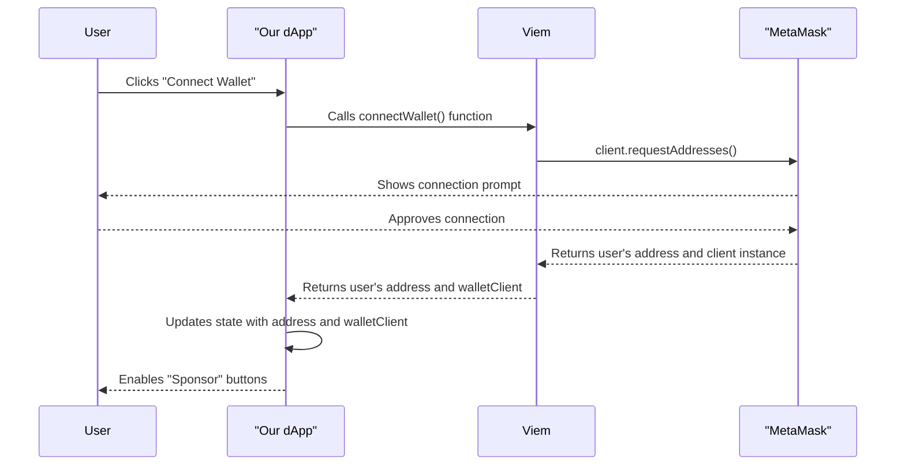

# Chapter 1: Connecting a Web3 Wallet

## Goal

The goal of this chapter is to connect a user's wallet and make the `walletClient` instance available for future use. The application content will always be visible, but interactive features, like sponsoring an author, will only become enabled after the user connects their wallet.

## Interaction Flow

This diagram shows the sequence of events when a user connects their wallet.



## Key Tasks

1.  **Install `viem`**: Add `viem` as a project dependency.
2.  **Implement Connection Logic**: In `App.tsx`, create a function that uses `viem` to connect to the user's wallet.
3.  **Store `walletClient` and `account` in State**: We will use `useState` hooks to store both the connected `account` address and the `walletClient` instance. The `walletClient` will be used in later chapters for signing messages.
4.  **Enable Sponsor Buttons**: Pass the connection status to the `PostList` component to enable the "Sponsor" buttons when a wallet is connected.

## Implementation Steps

### 1. Install `viem`

Open your terminal and run the following command in the project root:

```bash
npm install viem
```

### 2. Update the `PostList` Component

First, modify `src/components/PostList/PostList.tsx` to accept a prop `isWalletConnected` and use it to enable or disable a new "Sponsor" button.

```tsx
// filepath: src/components/PostList/PostList.tsx
import { type Post } from '../../data/posts';
import styles from './PostList.module.css';

interface PostListProps {
    posts: Post[];
    isWalletConnected: boolean;
}

export function PostList({ posts, isWalletConnected }: PostListProps) {
    const handleTip = (post: Post) => {
        // --- WORKSHOP: INSTANT TIP LOGIC ---
        console.log('Tipping post:', post.id, 'by', post.authorName);
    };

    const formatDate = (dateString: string) => {
        const date = new Date(dateString);
        const now = new Date();
        const diffTime = Math.abs(now.getTime() - date.getTime());
        const diffDays = Math.ceil(diffTime / (1000 * 60 * 60 * 24));

        if (diffDays === 1) return 'yesterday';
        if (diffDays <= 7) return `${diffDays} days ago`;
        if (diffDays <= 14) return `${Math.ceil(diffDays / 7)} week ago`;
        if (diffDays <= 30) return `${Math.ceil(diffDays / 7)} weeks ago`;

        return date.toLocaleDateString('en-US', {
            month: 'short',
            day: 'numeric',
            year: 'numeric',
        });
    };

    return (
        <section className={styles.container}>
            <div className={styles.grid}>
                {posts.map((post, index) => (
                    <article key={post.id} className={styles.card}>
                        <div className={styles.cardContent}>
                            <span className={styles.showNumber}>{index + 1}</span>
                            <div className={styles.details}>
                                <p className={styles.date}>
                                    {post.type} <span>×</span>{' '}
                                    <time dateTime={post.createdAt}>{formatDate(post.createdAt)}</time>
                                </p>
                                <h4 className={styles.showTitle}>{post.title}</h4>
                                <p className={styles.description}>{post.content}</p>
                            </div>
                        </div>
                        <footer className={styles.cardFooter}>
                            <button
                                onClick={() => handleTip(post)}
                                disabled={!isWalletConnected}
                                className={styles.sponsorButton}
                                title={
                                    !isWalletConnected ? 'Connect your wallet to sponsor' : 'Sponsor author with 1 USDC'
                                }
                            >
                                Sponsor
                            </button>
                        </footer>
                    </article>
                ))}
            </div>
        </section>
    );
}
```

### 3. Add Styles for the Sponsor Button

Next, add the necessary styles for the button and its container to `src/components/PostList/PostList.module.css`.

```css
// filepath: src/components/PostList/PostList.module.css
/* ... existing styles ... */
.card {
    /* ... existing styles ... */
    display: flex;
    flex-direction: column;
    justify-content: space-between;
}

.cardContent {
    display: flex;
}

.cardFooter {
    padding: 1rem 1.5rem 1.5rem;
    margin-left: 4.5rem; /* Align with details */
    border-top: 1px solid var(--border);
    margin-top: 1rem;
}

.sponsorButton {
    background-color: transparent;
    border: 1px solid var(--accent);
    color: var(--accent);
    padding: 0.5rem 1rem;
    border-radius: 6px;
    cursor: pointer;
    font-weight: 500;
    transition:
        background-color 0.2s,
        color 0.2s;
}

.sponsorButton:hover:not(:disabled) {
    background-color: var(--accent);
    color: white;
}

.sponsorButton:disabled {
    border-color: var(--border);
    color: var(--text-secondary);
    cursor: not-allowed;
    opacity: 0.6;
}
```

### 4. Update `App.tsx`

Finally, modify `src/App.tsx` to manage the `walletClient` and `account` state, and to pass the connection status down to the `PostList`.

```tsx
// filepath: src/App.tsx
import { useState } from 'preact/hooks';
import { createWalletClient, custom, type Address, type WalletClient } from 'viem';
import { mainnet } from 'viem/chains';
import { PostList } from './components/PostList/PostList';
import { posts } from './data/posts';

export function App() {
    const [account, setAccount] = useState<Address | null>(null);
    const [walletClient, setWalletClient] = useState<WalletClient | null>(null);

    const connectWallet = async () => {
        if (!window.ethereum) {
            alert('Please install MetaMask!');
            return;
        }
        const client = createWalletClient({
            chain: mainnet,
            transport: custom(window.ethereum),
        });
        const [address] = await client.requestAddresses();
        setWalletClient(client);
        setAccount(address);
    };

    const formatAddress = (address: Address) => `${address.slice(0, 6)}...${address.slice(-4)}`;

    return (
        <div className="app-container">
            <header className="header">
                <div className="header-content">
                    <h1 className="logo">Nexus</h1>
                    <p className="tagline">Decentralized insights for the next generation of builders</p>
                </div>
                <div className="wallet-connector">
                    {account ? (
                        <div className="wallet-info">Connected: {formatAddress(account)}</div>
                    ) : (
                        <button onClick={connectWallet} className="connect-button">
                            Connect Wallet
                        </button>
                    )}
                </div>
            </header>

            <main className="main-content">
                <PostList posts={posts} isWalletConnected={!!account} />
            </main>
        </div>
    );
}
```

## Expected Outcome

After completing this chapter, the application will always display the list of posts. A "Connect Wallet" button in the header will allow users to connect. Once connected, their address will be displayed, and the "Sponsor" button on each post will become enabled. The `walletClient` instance is now stored in the app's state, ready for the next
